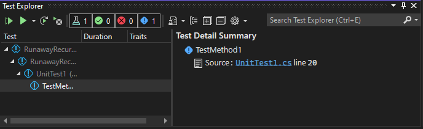
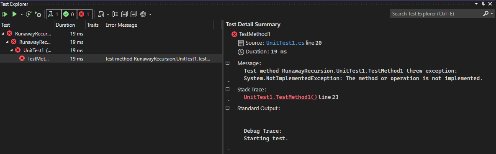
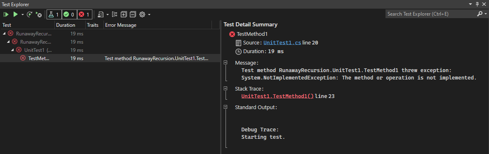

RunawayRecursion
================

This solution is a demonstration of a defect in the display of information
in the Test Explorer of Visual Studio as of version 17.0.2.

There is a single test in given project, which attempts an infinite series 
of recursive calls. This ultimately results in an Access Violation by
testhost.exe. The defect is that the information in the Test Explorer is
not updated.

If run for the first time, the test explorer will appear as it does below.
There is no indication that the test has failed.

If the "throw new NotImplementedException()" call in "TestMethod1" is
uncommented and the test run again, the test explorer will change to
the next image. I have expanded the window for this
snapshot to display all information.

If that line is commented and the test run once more, the test explorer
will appear as it does below. You may note that the status indictor next
to "TestMet..." is not coloured in. However, the "Test Detail Summary"
panel still indicates the previous error - it appears
that the test has not been recompiled.

The desired behaviour is for the Test Explorer to unambigiously display the
following information:

1. The test has failed.
2. The failure was the result of an 'Access Violation' (possible stack overflow.)
3. Any debugging output created before the failure of the test.
